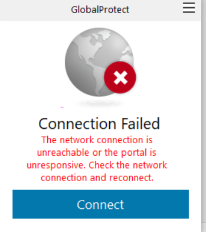

1. Connecting to Test Server
===================================
a. Downloading Palo Alto GlobalProtect VPN
----------------------------------------------
Downloading Palo Alto GlobalProtect VPN from https://www.marshall.edu/it/departments/it-service-desk/network-wireless/

.. image:: images/P0.png

When you click on Palo Alto GlobalProtect, it will take you to the following page where you can install it based on the version of your computer system.

.. image:: images/P1.png 

b. Connecting to VPN 
--------------------------------------------
When you completed to install, you can find the icon of GlobalProtect in the start menu.

Then, you can click the Settings button and add vpn.marshall.edu to the following page. Then, you can connect the GlobalProtect

.. image:: images/P4.png

c. Open the SSH client
-----------------------------------------
You can use Windows PowerShell(or PuTTy from https://www.putty.org/)

When you enter the PowerShell, you can use command below: 
ssh `yourID@csmars.marshall.edu`(i.e `zhao54@csmars.marshall.edu`) to process and enter your MyMU password when it prompted the password command.

.. image:: images/P5.png

Then, you will see the Ubuntu startup guidance shown above. 

Finally, you can use logout command to close the SSH and disconnect from Marshall VPN when you finished the process.

.. image:: images/P6.png

